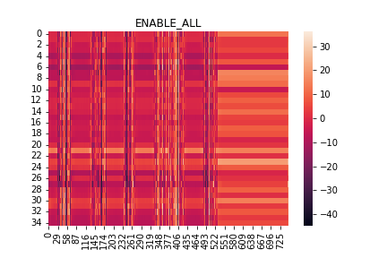
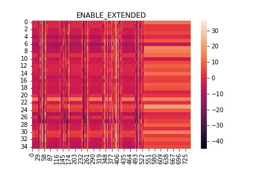
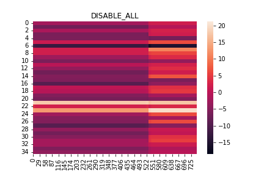
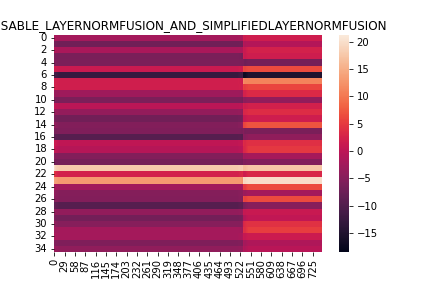
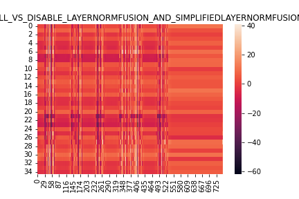
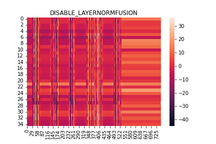
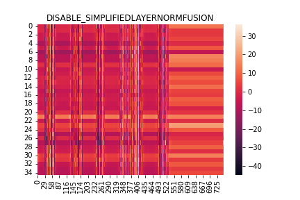

I have an ONNX model. When I compare the network outputs with different settings of optimizer, I observe a significant difference in the output tensors:

1. The heatmap below shows an output tensor with `ort.GraphOptimizationLevel.ORT_ENABLE_ALL`

2. The heatmap below shows an output tensor with `ort.GraphOptimizationLevel.ORT_ENABLE_EXTENDED`

3. The heatmap below shows an output tensor with `ort.GraphOptimizationLevel.ORT_DISABLE_ALL`. Here we can see that heatmap of output tensor is completely different from the previous two heatmaps. And the range of tensor values is also different.

Max absolute diff between output logits of model with `ort.GraphOptimizationLevel.ORT_ENABLE_ALL` and model with `ort.GraphOptimizationLevel.ORT_DISABLE_ALL`: 61.765625

Mean absolute diff between output logits of model with `ort.GraphOptimizationLevel.ORT_ENABLE_ALL` and model with `ort.GraphOptimizationLevel.ORT_DISABLE_ALL`: 6.6345534324646

4. We tried to disable different optimizers and found out that disabling `LayerNormFusion` and `SimplifiedLayerNormFusion` optimizers at the same time is leading to broken tensor outputs.

The heatmap below shows a difference between output tensors with `ort.GraphOptimizationLevel.ORT_ENABLE_ALL` and disabled `LayerNormFusion` and `SimplifiedLayerNormFusion`.

Max absolute diff between output logits of model with `ort.GraphOptimizationLevel.ORT_ENABLE_ALL` and model with disabled `LayerNormFusion` and `SimplifiedLayerNormFusion`: 61.765625

Mean absolute diff between output logits of model with `ort.GraphOptimizationLevel.ORT_ENABLE_ALL` and model with disabled `LayerNormFusion` and `SimplifiedLayerNormFusion`: 6.6345534324646

5. However disabling `LayerNormFusion` and `SimplifiedLayerNormFusion` seperatly does not break tensor outputs.

I think this is a bug when two optimizers `LayerNormFusion` and `SimplifiedLayerNormFusion` are disabled at the same time. To reproduce results you can use jupyter notebook `issue_with_optimizers.ipynb` or run the script `python compare_enabled_all_vs_disabled_optimizers_outputs.py`.

Thanks

### Not urgent

### Platform
Linux

### OS Version
Ubuntu 20.04

### ONNX Runtime Version
onnxruntime==1.9.0

### ONNX Runtime API
Python

### Architecture
X64

### Execution Provider
CUDA

### Execution Provider Library Version
CUDA Version: 12.0
